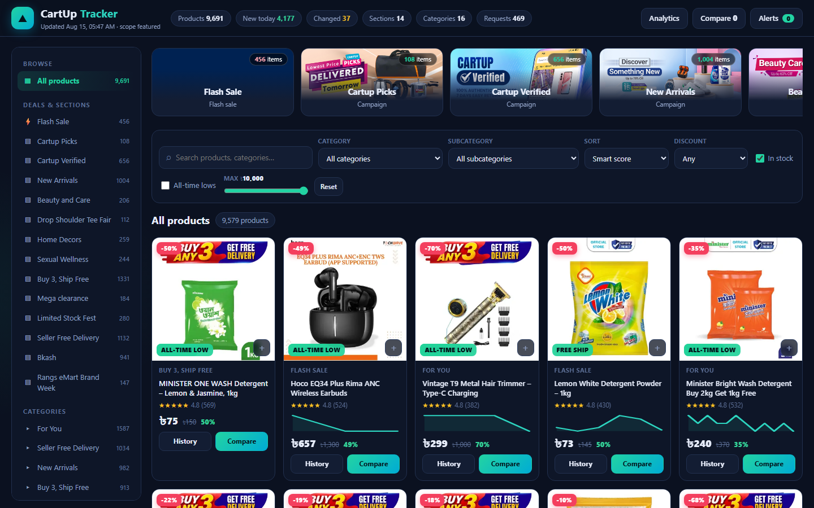
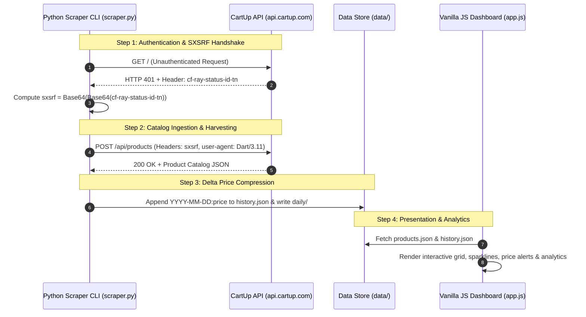

# 🛒 CARTup Analytics & Daily Price Tracker

> **Automated, Pure-Python API Scraper, Daily Price Snapshot Pipeline & High-Performance Analytics Dashboard for CartUp Bangladesh.**

[](https://ranehal.github.io/CARTup-analytics/)
[-3776AB?style=for-the-badge&logo=python&logoColor=white)](https://www.python.org/)
[](https://developer.mozilla.org/)
[](LICENSE)

---

## 📌 Executive Summary

**CARTup Analytics** is an end-to-end price monitoring, market analytics, and deal discovery engine engineered for [CartUp Bangladesh](https://www.cartup.com) (`api.cartup.com`). 

The platform reverse-engineers CartUp's mobile app security headers (`sxsrf`), executes concurrent API harvesting without third-party dependencies, logs zero-duplication price history deltas, and renders an interactive web application featuring sparklines, price drop alerts, section cards, and category analytics.

---

## 🚀 Key Features

- **🔐 Cryptographic Handshake & Auth Derivation**: Implements automatic handling of CartUp's double Base64 `sxsrf` security token derived dynamically from Cloudflare `cf-ray-status-id-tn` response headers.
- **⚡ Zero-Dependency Scraper Core**: Built strictly using Python standard libraries (`urllib`, `gzip`, `base64`, `json`), requiring zero external `pip` packages.
- **📈 Efficient Delta Price History**: Appends `YYYY-MM-DD:price` records only when prices change, keeping `data/history.json` lightweight while storing daily snapshots in `data/daily/`.
- **🌳 Complete Catalog Hierarchy**: Navigates 3 catalog depth levels across 16 top categories, 169 mid-level categories, and 1,232 leaf categories (~600k potential SKUs).
- **📊 Sparklines & Price Target Alerts**: Dynamic SVG sparklines per card, 30D / 90D / 1Y / All price charts, custom price target alerts saved in `localStorage`, and section strip views (Flash Sales, Mega Offers).

---

## 📸 Screenshots

> Captured from a live localhost run of the dashboard.

| Dashboard |
| :---: |
|  |

---

## 🏗️ System Architecture



---

## 🔑 Authentication & API Specification

The CartUp mobile backend at `api.cartup.com` enforces a challenge-response handshake:

1. **Challenge Phase**: Any unauthenticated request returns `HTTP 401 Unauthorized` with response header `cf-ray-status-id-tn` containing a Base64-encoded JSON payload `{"expires", "sign", "random"}`.
2. **Signature Computation**: The token must be double Base64-encoded:
   $$\text{sxsrf} = \text{Base64}\left(\text{Base64}\left(\text{cf-ray-status-id-tn}\right)\right)$$
3. **Request Verification**: Substituted as header `sxsrf` with custom User-Agent:
   - `user-agent`: `Dart/3.11 (dart:io)`
   - `origin`: `cartup-prod`
   - `isapp`: `1`
   - `accept-encoding`: `gzip`

---

## 📁 Repository Structure

```
CARTup/
├── scraper.py           # Pure-Python CLI ingestion engine (urllib, standard library)
├── index.html           # Single-page web dashboard markup
├── app.js               # Zero-framework JavaScript SPA (Chart rendering, filtering, alerts)
├── style.css            # Responsive dark/light mode stylesheet
├── runall.bat           # Interactive Windows batch launcher
├── data/
│   ├── products.json    # Compact product metadata catalog
│   ├── history.json     # Compressed daily price history map (date:price strings)
│   ├── meta.json        # Category tree, channel list, and snapshot stats
│   └── daily/           # Daily delta JSON snapshots (YYYY-MM-DD.json)
└── .github/workflows/
    └── daily.yml        # GitHub Actions workflow for automated daily price runs
```

---

## 🛠️ Data Schema (`data/products.json`)

| Field Key | Data Type | Description |
| :--- | :--- | :--- |
| `i` | `Integer` | Unique CartUp Product ID |
| `n` | `String` | Product Name |
| `img` | `String` | Relative S3 image path |
| `p` | `Number` | Current Discounted Selling Price (৳) |
| `m` | `Number` | Maximum Retail Price / MRP (৳) |
| `d` | `Number` | Calculated Discount Percentage |
| `st` | `Boolean` | In-Stock Availability Status |
| `c` / `t` / `sc` | `String` | Category path / Top Category / Subcategory |

---

## ⚡ Quick Start & Usage

### 1. Interactive Windows Launcher
Double-click or execute [`runall.bat`](file:///C:/PROJECTS/CARTup/runall.bat):
```cmd
runall.bat
```
Select:
- `[1] scraper` — Scrape latest product catalog & update price history.
- `[2] dashbrd` — Launch local HTTP dashboard server (`http://localhost:3000`).
- `[3] both` — Execute scraper followed by launching the dashboard server.

### 2. Manual Scraper CLI
```bash
# Scrape featured catalog scope (14 channels, flash deals, mega pages)
python scraper.py --scope=featured --concurrency=6 --pages=5

# Scrape complete catalog across 1,232 leaf categories (~600k SKUs)
python scraper.py --scope=full

# Serve web dashboard locally
python -m http.server 3000
```

---

## 🚀 Future Work & Industrial Roadmap

To elevate this platform to an enterprise-grade, production-ready product meeting current industrial standards, the following strategic goals and architecture enhancements are planned:

### 1. 🏗️ High-Availability Microservices & Infrastructure
- **Containerization & Orchestration**: Package ingestion workers, APIs, and dashboards into Docker containers with deployment via **Kubernetes (K8s)** and Helm charts for autoscaling during peak traffic hours.
- **Distributed Ingestion Workers**: Transition from localized scraping scripts to an asynchronous, fault-tolerant worker pool utilizing **Celery + Redis** or **Temporal.io** with automated proxy rotation, rate-limiting retry strategies, and CAPTCHA bypass capabilities.
- **High-Performance API Gateway**: Implement an enterprise API Gateway (Kong / Envoy) providing OAuth2 / JWT authentication, TLS termination, and granular rate limiting (Token Bucket algorithm).

### 2. 📊 Enterprise Data Engineering & Streaming Pipelines
- **Data Lakehouse Architecture**: Store multi-year raw price histories using **Apache Parquet / Delta Lake** or **Google BigQuery** for scalable analytical queries across millions of SKU updates.
- **Real-Time CDC & Message Streaming**: Integrate **Apache Kafka** or **NATS** for Change Data Capture (CDC) to stream price change events instantly to downstream analytics and notification consumers.
- **Automated Workflow Orchestration**: Schedule and monitor data ingestion, ETL pipelines, and unit normalization using **Apache Airflow** or **Prefect** integrated with **dbt** for dynamic data transformations.

### 3. 🧠 Machine Learning & Advanced Market Intelligence
- **Predictive Price Forecasting**: Deploy **Prophet** and **LSTM Neural Networks** to predict future price drops, historical promotion trends, and seasonal discount cycles.
- **Anomaly & Surge Detection**: Build ML models to identify artificial price hikes before promotional sales, mislabeled unit metrics, and phantom stock availability.
- **Semantic Product Entity Matching**: Utilize vector embeddings (OpenAI / Sentence-Transformers) paired with **pgvector** / **Pinecone** to match identical SKUs across competitor platforms despite variations in naming formats.

### 4. 🔐 Security, Compliance & System Observability
- **Zero-Trust Security & RBAC**: Enforce Role-Based Access Control (RBAC), AES-256 GCM payload encryption at rest, and secret rotation via HashiCorp Vault.
- **Full Observability Stack**: Instrument services with **OpenTelemetry**, emitting distributed traces, Prometheus metrics, and structured logs to **Grafana Loki & Tempo** dashboards.
- **SLA Alerting & Webhook Engine**: Provide instant trigger notifications via **Telegram Bot API**, **Discord Webhooks**, email notifications, and enterprise SMS gateways when watched items reach target prices.

### 5. 📱 Next-Gen User Experience & Mobile Platforms
- **Cross-Platform Mobile App**: Develop a dedicated **React Native / Flutter** app featuring push notifications for price drops, barcode scanning in physical stores, and personalized deal watchlists.
- **Progressive Web App (PWA)**: Upgrade the dashboard to a full PWA with offline caching via Service Workers, dynamic theme switching, and desktop application installability.
### 1. Architecture & Infrastructure
- **Containerization & Orchestration**: Package scraper + dashboard as Docker images; deploy with `docker-compose` locally and Kubernetes (EKS/GKE) for horizontal scaling.
- **Managed Databases**: Migrate from file-based JSON + local SQLite to a managed PostgreSQL (RDS/Cloud SQL) with proper indexing, partitioning (daily/monthly price tables), and connection pooling (PgBouncer).
- **Message Queue for Ingestion**: Replace naive in-process concurrency with a broker-backed pipeline (Redis Streams / RabbitMQ / Kafka) for retryable, resumable catalog harvesting with dead-letter queues.
- **Object Storage + CDN**: Store raw daily snapshots in S3/Cloudflare R2 with a CDN (CloudFront/Cloudflare) for static assets and datasets; enforce lifecycle policies for archival.
- **Caching Layer**: Redis for hot queries (stats, category trees, recent products) with TTL-based invalidation; ETag/If-Modified-Since headers on all API responses.

### 2. Reliability & Observability
- **Structured Logging & Tracing**: Replace `print`/log files with JSON structured logging (pino/structlog), correlated request IDs, and OpenTelemetry tracing across scraper → queue → DB → API.
- **Metrics & Alerting**: Prometheus metrics (scrape success rate, latency percentiles, job durations) + Grafana dashboards + PagerDuty/AlertManager alerts on pipeline failure.
- **SLOs & Health Checks**: `/health`, `/ready` endpoints; scraper watchdog that auto-recovers from stuck sessions; idempotent job resumption from checkpoint state.
- **Automated Testing**: Unit tests for token derivation, delta compression, and API parsing; integration tests with recorded fixtures; end-to-end Playwright tests for the dashboard.

### 3. Security & Compliance
- **Secret Management**: Move all credentials into a vault (AWS Secrets Manager / HashiCorp Vault / Doppler) — never baked into images or repos.
- **Auth & Rate Limiting**: API-key/JWT-based access control with per-tenant rate limiting (e.g., `limits` / Kong); TLS everywhere; dependency scanning (Snyk/Dependabot) and SBOM generation.
- **Respectful Crawling**: Implement robots.txt compliance, domain-wide polite rate limiting, exponential backoff, and traffic shaping to avoid impacting the upstream service.

### 4. Data Platform & Analytics
- **Warehouse & BI**: Land normalized datasets into a columnar warehouse (ClickHouse/BigQuery) with dbt for transformations; build Looker/Metabase dashboards.
- **Streaming Prices**: Migrate daily batch snapshots to near-real-time streaming (Kafka → Flink/Spark Structured Streaming) for live price movement detection.
- **ML / Forecasting**: Add time-series forecasting (Prophet/ARIMA/LightGBM) for price prediction, anomaly detection on price drops, and personalized deal recommendations.

### 5. Product & UX
- **User Accounts & Sync**: OAuth2 accounts, cross-device watchlists/alerts, and email/push notifications (SendGrid/FCM) when target prices are hit.
- **Public API & Docs**: Versioned, documented public REST API (OpenAPI) with rate limits and developer keys; optional GraphQL gateway.
- **Localization & Accessibility**: Full i18n (bn/en), WCAG 2.1 AA compliance, dark/light theming consistency, and mobile-first responsive PWA with offline mode.
- **Performance Budget**: Code-splitting, virtualized product lists, lazy-loaded charts, and Lighthouse budgets enforced in CI (CLS < 0.1, LCP < 2.5s).

---

## 📜 License & Disclaimer

Distributed under the MIT License. Data and trademarks belong to CartUp. Built for educational and price analytics purposes.
