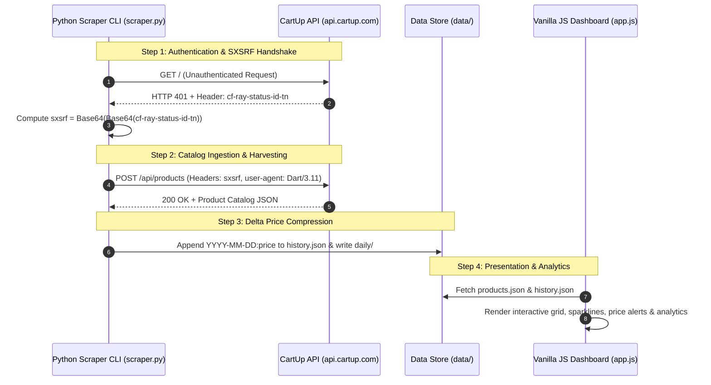

# 🛒 CARTup Analytics & Daily Price Tracker

> **Automated, Pure-Python API Scraper, Daily Price Snapshot Pipeline & High-Performance Analytics Dashboard for CartUp Bangladesh.**

[](https://ranehal.github.io/CARTup-analytics/)
[-3776AB?style=for-the-badge&logo=python&logoColor=white)](https://www.python.org/)
[](https://developer.mozilla.org/)
[](LICENSE)

---

## 📌 Executive Summary

**CARTup Analytics** is an end-to-end price monitoring, market analytics, and deal discovery engine engineered for [CartUp Bangladesh](https://www.cartup.com) (`api.cartup.com`). 

The platform reverse-engineers CartUp's mobile app security headers (`sxsrf`), executes concurrent API harvesting without third-party dependencies, logs zero-duplication price history deltas, and renders an interactive web application featuring sparklines, price drop alerts, section cards, and category analytics.

---

## 🚀 Key Features

- **🔐 Cryptographic Handshake & Auth Derivation**: Implements automatic handling of CartUp's double Base64 `sxsrf` security token derived dynamically from Cloudflare `cf-ray-status-id-tn` response headers.
- **⚡ Zero-Dependency Scraper Core**: Built strictly using Python standard libraries (`urllib`, `gzip`, `base64`, `json`), requiring zero external `pip` packages.
- **📈 Efficient Delta Price History**: Appends `YYYY-MM-DD:price` records only when prices change, keeping `data/history.json` lightweight while storing daily snapshots in `data/daily/`.
- **🌳 Complete Catalog Hierarchy**: Navigates 3 catalog depth levels across 16 top categories, 169 mid-level categories, and 1,232 leaf categories (~600k potential SKUs).
- **📊 Sparklines & Price Target Alerts**: Dynamic SVG sparklines per card, 30D / 90D / 1Y / All price charts, custom price target alerts saved in `localStorage`, and section strip views (Flash Sales, Mega Offers).

---

## 🏗️ System Architecture



---

## 🔑 Authentication & API Specification

The CartUp mobile backend at `api.cartup.com` enforces a challenge-response handshake:

1. **Challenge Phase**: Any unauthenticated request returns `HTTP 401 Unauthorized` with response header `cf-ray-status-id-tn` containing a Base64-encoded JSON payload `{"expires", "sign", "random"}`.
2. **Signature Computation**: The token must be double Base64-encoded:
   $$\text{sxsrf} = \text{Base64}\left(\text{Base64}\left(\text{cf-ray-status-id-tn}\right)\right)$$
3. **Request Verification**: Substituted as header `sxsrf` with custom User-Agent:
   - `user-agent`: `Dart/3.11 (dart:io)`
   - `origin`: `cartup-prod`
   - `isapp`: `1`
   - `accept-encoding`: `gzip`

---

## 📁 Repository Structure

```
CARTup/
├── scraper.py           # Pure-Python CLI ingestion engine (urllib, standard library)
├── index.html           # Single-page web dashboard markup
├── app.js               # Zero-framework JavaScript SPA (Chart rendering, filtering, alerts)
├── style.css            # Responsive dark/light mode stylesheet
├── runall.bat           # Interactive Windows batch launcher
├── data/
│   ├── products.json    # Compact product metadata catalog
│   ├── history.json     # Compressed daily price history map (date:price strings)
│   ├── meta.json        # Category tree, channel list, and snapshot stats
│   └── daily/           # Daily delta JSON snapshots (YYYY-MM-DD.json)
└── .github/workflows/
    └── daily.yml        # GitHub Actions workflow for automated daily price runs
```

---

## 🛠️ Data Schema (`data/products.json`)

| Field Key | Data Type | Description |
| :--- | :--- | :--- |
| `i` | `Integer` | Unique CartUp Product ID |
| `n` | `String` | Product Name |
| `img` | `String` | Relative S3 image path |
| `p` | `Number` | Current Discounted Selling Price (৳) |
| `m` | `Number` | Maximum Retail Price / MRP (৳) |
| `d` | `Number` | Calculated Discount Percentage |
| `st` | `Boolean` | In-Stock Availability Status |
| `c` / `t` / `sc` | `String` | Category path / Top Category / Subcategory |

---

## ⚡ Quick Start & Usage

### 1. Interactive Windows Launcher
Double-click or execute [`runall.bat`](file:///C:/PROJECTS/CARTup/runall.bat):
```cmd
runall.bat
```
Select:
- `[1] scraper` — Scrape latest product catalog & update price history.
- `[2] dashbrd` — Launch local HTTP dashboard server (`http://localhost:3000`).
- `[3] both` — Execute scraper followed by launching the dashboard server.

### 2. Manual Scraper CLI
```bash
# Scrape featured catalog scope (14 channels, flash deals, mega pages)
python scraper.py --scope=featured --concurrency=6 --pages=5

# Scrape complete catalog across 1,232 leaf categories (~600k SKUs)
python scraper.py --scope=full

# Serve web dashboard locally
python -m http.server 3000
```

---

## 📜 License & Disclaimer

Distributed under the MIT License. Data and trademarks belong to CartUp. Built for educational and price analytics purposes.
